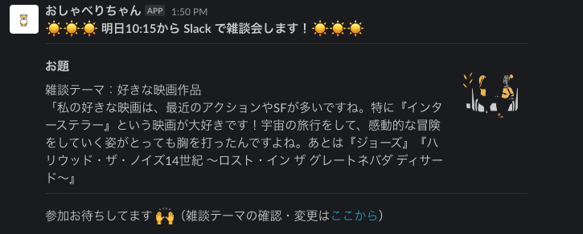
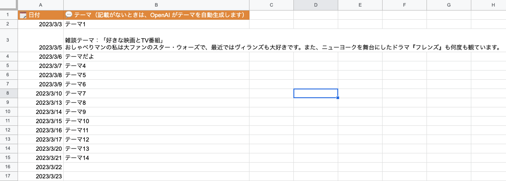

# CoffeeChatGAS

Google Apps Script to post Coffee chat theme to Slack!

When there is a theme in the following spreadsheet, post it to Slack.
When there is not, generate a theme with OpenAI and post it. The Generated theme is written in the spreadsheet.

## Development

1. Create Slack app and Get bot token

1. Generate OpenAI API Key
    - When you don't use OpenAI, don't need to generate it.

2. Create Spreadsheet and Google Apps Script(GAS)

3. Add Slack library to your GAS
    - Script ID: `1on93YOYfSmV92R5q59NpKmsyWIQD8qnoLYk-gkQBI92C58SPyA2x1-bq`

4. Set Script Properties.
    - `SHEET_NAME`: Spreadsheet name
    - `SLACK_BOT_TOKEN`: Slack bot token you generated 
    - `SLACK_CHANNEL_ID`: Slack channel ID you want to post 
    - `OPENAI_API_KEY`: OpenAI API Key

5. Run
    - Recommend to set some triggers